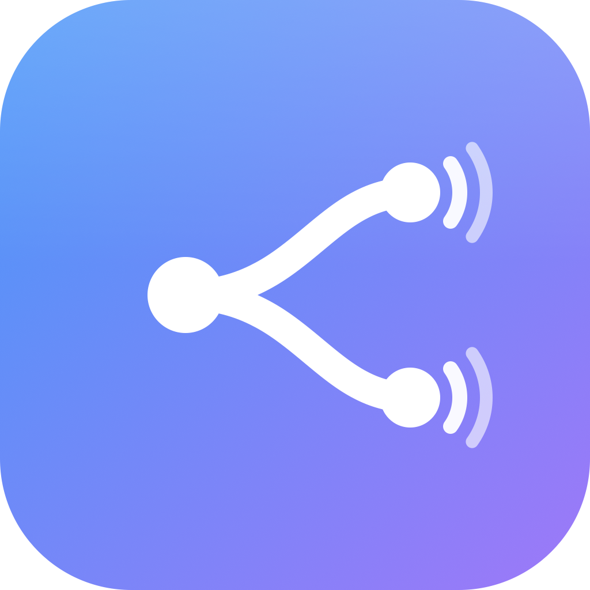

<p align="center">
  
</p>

# SoundSplitter 🔊

Alternativa **open source** a SoundSource para macOS. Captura el audio del
sistema o de **apps concretas** y lo reenvía a las salidas que elijas —
**cada app a su propio destino y todas a la vez**. Por ejemplo:

- 🦁 **Brave → altavoces del Mac**
- 🌐 **Chrome → Galaxy Buds**
- 🎵 **Spotify → altavoces + un DAC USB** a la vez

…con **volumen y silencio por fuente**, sin driver de audio virtual ni
extensión de kernel: usa la API nativa **Core Audio Process Taps** (macOS 14.4+).

> **Estado: v0.3.** El motor usa la misma técnica que SoundSource/FineTune:
> un **aggregate device de CoreAudio con compensación de drift** por fuente, así
> que **no hay micro-cortes ni delay añadido** — la sincronía la hace el HAL.
> UI rediseñada estilo *glass*.

---

## 📥 Instalación (desde el release)

1. Descarga el `.dmg` desde [**Releases**](../../releases/latest), ábrelo y
   **arrastra SoundSplitter a Aplicaciones**.
2. La app **no está notarizada por Apple** (proyecto gratuito), así que verás
   *"Apple could not verify…"*. Es esperado — desbloquéala con **una** opción:

   **A — Terminal (rápido):**
   ```bash
   xattr -dr com.apple.quarantine /Applications/SoundSplitter.app
   ```
   Luego ábrela normal.

   **B — Sin Terminal:** doble clic (sale el aviso → *Listo*), ve a **Ajustes del
   Sistema → Privacidad y seguridad**, y pulsa **"Abrir de todas formas"** junto
   al mensaje de SoundSplitter. Confirma con **Abrir**.
3. Al enrutar por primera vez, concede el **permiso de grabación de audio**
   (Ajustes → Privacidad y seguridad → Grabación de audio).

> ¿Por qué el aviso? Eliminarlo requiere **Developer ID + notarización de Apple**
> (cuenta de pago, $99/año). El desbloqueo de arriba es seguro: es tu descarga.

## 📦 Dónde está el DMG

`make dmg` lo genera en dos sitios visibles:

```
~/Desktop/SoundSplitter-0.1.0.dmg          ← copia en el Escritorio
<repo>/SoundSplitter-0.1.0.dmg             ← raíz del proyecto
```

## 🧭 Dónde está el log

Arranques, rutas, congelamientos y crashes se escriben en texto plano:

```
~/Library/Logs/SoundSplitter/soundsplitter.log
tail -f ~/Library/Logs/SoundSplitter/soundsplitter.log
```

Si algo falla, manda el final de ese archivo.

---

## Características

- 🎯 **Ruteo por app simultáneo**: varias apps, cada una a su salida, a la vez.
- 🌐 **Fuente "Todo el sistema"** para reenviar todo el audio del Mac.
- 🔀 **Multi-salida por fuente** (espejo a varios dispositivos vía aggregate *stacked*).
- 🎚️ **Volumen y mute por fuente**, con rampa de 30 ms (sin clicks).
- 🔇 Silencia la salida original (`.mutedWhenTapped`): el audio *se mueve* al destino.
- 🩺 **Log a archivo + watchdog de congelamientos + captura de crashes**.
- 🪶 **Menu bar app** en SwiftUI + AppKit, con panel *glass* estilo FineTune.

## Requisitos

- macOS **14.4+** (Core Audio Process Taps). Recomendado 15+.
- **Swift 5.9+** (Command Line Tools o Xcode).

## Compilar y empaquetar

```bash
make build     # debug
make bundle    # empaqueta SoundSplitter.app (firmada ad-hoc)
make open      # empaqueta y abre
make dmg       # genera el .dmg (raíz + Escritorio)
make run       # swift run directo
make clean
```

La primera vez que enrutes una fuente, macOS pedirá **permiso de grabación de
audio**: acéptalo en *Ajustes → Privacidad y seguridad → Grabación de audio*.

## Uso

1. Abre la app → icono de onda en la barra de menús.
2. **Clic izquierdo** = panel. **Clic derecho** = menú con encender/apagar global y **Salir**.
3. En cada fuente, pulsa el **selector de dispositivos** (icono altavoz ▾) y marca
   a qué salida(s) enviarla. El audio se enruta **al instante**.
4. Ajusta volumen/mute por fuente con el slider que aparece.

**Ejemplo:** en *Brave* elige *MacBook Pro Speakers*; en *Chrome* elige
*Galaxy Buds*. Ambas suenan a la vez, cada una en su sitio.

## Arquitectura

```
   Brave  ─▶ tap #1 ─┐
                     ├─▶ Aggregate device privado (tap + salidas, 1 IOProc)
   [salidas Brave] ──┘        │  el HAL sincroniza relojes (drift compensation)
                              ▼
                        Altavoces Mac

   Chrome ─▶ tap #2 ─▶ Aggregate #2 ─▶ Galaxy Buds
   Sistema─▶ tap #3 ─▶ Aggregate #3 ─▶ (varias salidas, stacked = espejo)

        └────────── AudioEngine (un RoutedSource por fuente) ──────────┘
                (todo el trabajo de Core Audio en un hilo aparte)
```

Cada fuente tiene su **propio tap + aggregate device privado** que embebe el tap
como sub-tap y las salidas como sub-devices. **Un solo IOProc** copia
tap→salidas; **CoreAudio** sincroniza los relojes y hace el resampling con
compensación de drift. Nada de ring buffers en espacio de usuario → sin cortes
ni delay. El trabajo de Core Audio corre en segundo plano para que la UI nunca
se congele.

| Componente | Rol |
|---|---|
| `CoreAudio/AudioObjectUtils` | Helpers tipados sobre `AudioObjectGetPropertyData`. |
| `CoreAudio/AudioDeviceManager` | Enumera salidas, sample rate, transporte (Bluetooth). |
| `CoreAudio/AudioProcessManager` | Lista procesos que reproducen audio. |
| `CoreAudio/Log` | Logging a `os_log` **y a archivo**. |
| `Engine/RoutedSource` | Tap + aggregate device + IOProc + drift comp + rampa de volumen. |
| `Engine/AudioEngine` | Un `RoutedSource` por fuente, reconciliado en segundo plano. |
| `Diagnostics` | Watchdog de congelamientos + captura de excepciones/señales. |
| `Model/AppState` | Matriz de ruteo observable. |
| `UI/DesignSystem` | Tokens de diseño, fondo *glass*, filas con hover, botón de mute. |
| `UI/MenuBarView` | Panel de la barra de menús. |
| `SoundSplitterApp` | `NSStatusItem` + `NSPopover`. |

### Compensación de drift (clave para no tener cortes)

- `kAudioSubDeviceDriftCompensationKey` = ON en todas las salidas salvo el reloj
  maestro (índice 0), que se elige preferentemente **no-Bluetooth**.
- `kAudioSubTapDriftCompensationKey` = **OFF si el reloj es Bluetooth** (forzarla
  ahí provoca un crujido cada ~0,7 s); ON para cable/USB.
- Rampa de volumen exponencial de 30 ms y arranque desde silencio → sin clicks.

## Diagnóstico de fallos

- **Congelamientos**: watchdog cada 0,5 s; si el hilo principal tarda >2 s
  escribe `[FREEZE]` con backtrace.
- **Crashes**: excepciones (`[CRASH]`) y señales fatales (`FATAL SIGNAL`).
- Toda la enumeración de Core Audio corre **fuera del hilo principal** (evita el
  bloqueo tras suspender/reanudar).
- **Al suspender** se liberan los aggregate devices; **al reanudar** se refrescan
  y reconstruyen las rutas.

## Limitaciones conocidas

- **Bluetooth**: añade ~150-250 ms de latencia inherente que ningún software
  puede eliminar. En espejo (Mac + BT a la vez) puede quedar un pequeño desfase
  fijo entre ambas salidas; la compensación de drift evita que empeore con el
  tiempo, pero no anula ese offset inicial.
- Los IDs de dispositivo pueden cambiar tras dormir / reconexión Bluetooth; si
  una ruta a BT no reanuda sola, vuelve a marcar esa salida.
- Si configuras "Todo el sistema" **y** una app a la vez, ese audio se captura
  dos veces (tap global + tap de la app).
- No hay volumen por dispositivo (es por fuente); ni EQ.

## Distribución

El `.dmg` va firmado **ad-hoc** (proyecto gratuito, sin cuenta de Apple). Al
descargarlo, macOS muestra *"Apple could not verify…"*. Es normal — se desbloquea
en 5 segundos con el método de la sección [Instalación](#-instalación-desde-el-release):

```bash
xattr -dr com.apple.quarantine /Applications/SoundSplitter.app
```

**Opcional (requiere cuenta Apple Developer de pago, $99/año):** para eliminar el
aviso por completo (como FineTune), hay un pipeline de firma Developer ID +
notarización listo en `scripts/notarize.sh` / `make notarize`. No es necesario
para usar la app.

## Roadmap

- [ ] Volumen por dispositivo (mapeo de canales del aggregate stacked).
- [ ] Persistir la matriz de ruteo entre lanzamientos.
- [ ] Fijar rutas por **UID** estable (sobrevive a sleep / reconexión BT).
- [ ] Excluir del tap global las apps con ruta propia (evitar doble captura).
- [ ] Crossfade equal-power al cambiar de dispositivo (como FineTune).
- [ ] EQ y efectos por fuente.

## Licencia

MIT. Ver [LICENSE](LICENSE).
